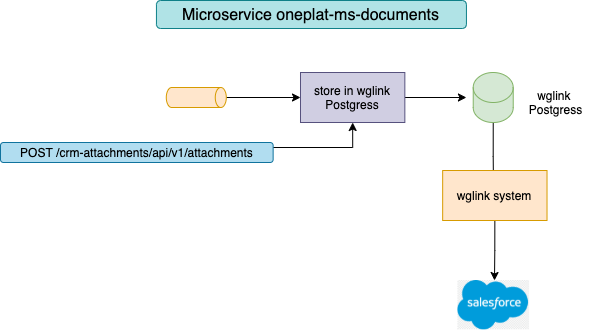
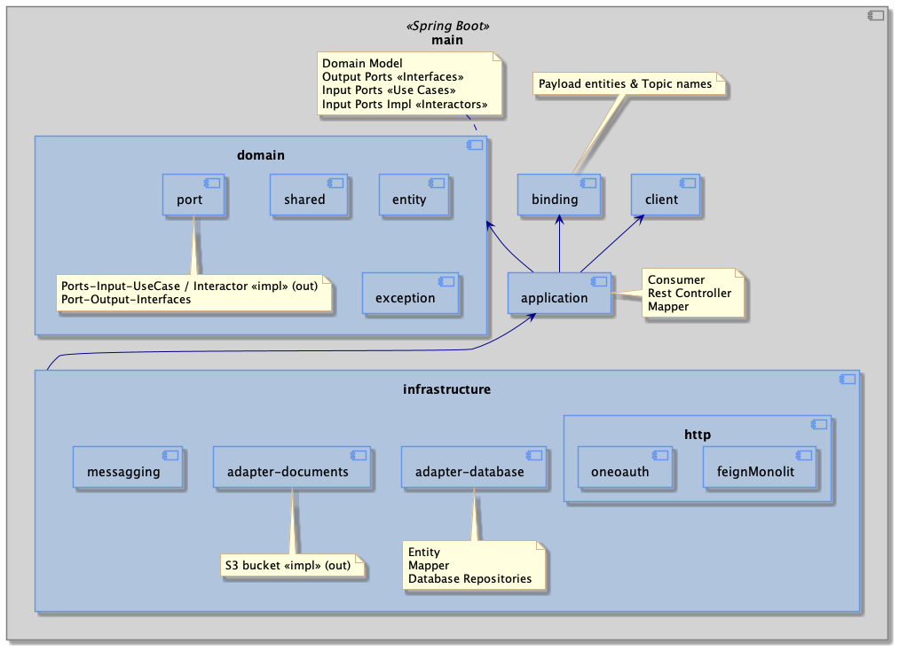
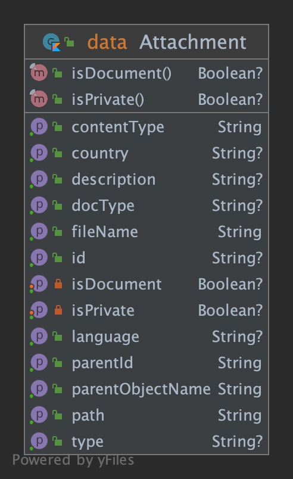
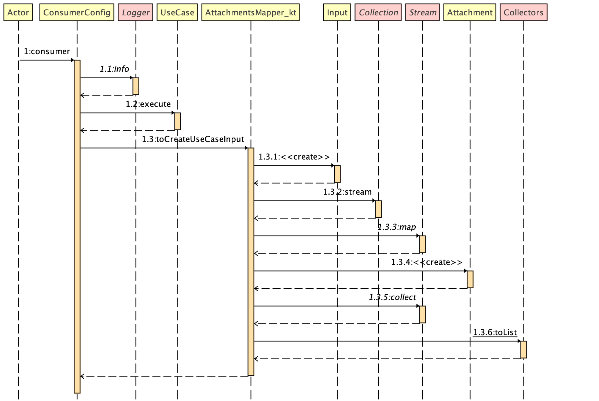

# Attachments Microservice

## Build project
Setup environment
```shell
```

### Project specifics
- Docker must be installed.
- Gradle wrapper is used to create the build.

### Maven build
```shell
./mvnw clean package
```
Produces a spring boot application located at `application/target/application.jar`

### Gradle build
```shell
./gradlew clean build
```
Produces a spring boot application located at `application/target/application.jar`

### Build & run

Compile and then build the image
```shell
chmod +x start.sh
# open terminal & run docker 
docker compose up
# open another terminal session & run
./start.sh
```

## :running_man: Run locally

### Environment
List of environment variables that may be available during runtime

| Variable | default | Description |
| --- | --- | --- |
| APP_PROFILE | dev, stg, pro | profile |
| APP_GATEWAY_URL | http://.... | gateway url |
| APP_SERVER_PORT | 8080 | server port |
| APP_POSTGRES_HOST | localhost | wglink host of postgres |
| APP_POSTGRES_PORT | 5432 | wglink postgres port |
| APP_POSTGRES_DB | attachments | wglink postgres database |
| APP_POSTGRES_SCHEMA | public | - |
| APP_POSTGRES_USER | user | - |
| APP_POSTGRES_PASSWORD | password | - |
| APP_KAFKA_BROKERS | localhost:29092 | - |
| APP_KAFKA_SECURITY_PROTOCOL | - | For secure communication use: SSL |
| APP_KAFKA_TRUSTSTORE | - | For secure communication use: /application/kafka.client.truststore.jks |
| APP_KAFKA_REPLICATION_FACTOR | 1 | should be increased on production |
| APP_TOPIC_EXECUTE_CREATE_ATTACHMENTS_COMMAND | command.create-documents | kafka topic command |
| APP_TOPIC_EXECUTE_CREATE_ATTACHMENTS_GROUP | group.documents| kafka topic group |
| APP_TOPIC_EXECUTE_CREATE_ATTACHMENTS_ERROR | command.create-documents.dlq | kafka topic dlq |
| LOGSTASH_HOST | localhost:5000 | Not used unless "logstash" is spring profile is active |
| APP_OAUTH_SERVER | https://dev.jandrinet.com/auth/realms/jandrinet | - |
| APP_OAUTH_SERVER_CERTS | https://dev.jandrinet.com/auth/realms/jandrinet/protocol/openid-connect/certs | - |
| APP_OAUTH_SCOPE | crm-attachments | - |

### Kafkacat
Install</br>
```
brew install kafkacat
```

Send something to a topic</br>
```
kafkacat -b localhost:29092 -t command.create-documents -P
```

View a topic</br>
```
kafkacat -L -b localhost:29092 -t command.create-documents
```

View number of messsages into topic</br>
```
kafkacat -b localhost:29092 -t command.create-documents -C -e -q| wc -l
```

## :jigsaw: Naming and modules

### Architecture
architecture:



### Modules
The project is divided in the following modules:



### Domain Class Diagram
These are the main entities in the ms-domain:



### Sequence Class Diagram
These are the main entities in the ms-domain:



### Database
* Optimistic locking [link](https://docs.spring.io/spring-data/r2dbc/docs/current/reference/html/#r2dbc.optimistic-locking)
